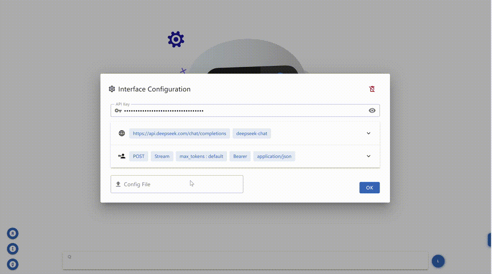

# Chat UI

<p align="left">
  <a href="https://vuejs.org/">
    
  </a>
  &nbsp
  <a href="https://vuetifyjs.com/">
    
  </a>
  &nbsp
  <a>
    
  </a>
  &nbsp
  <a href="https://hub.docker.com/repository/docker/aiql/chat-ui/tags?page=1&ordering=last_updated">
    
  </a>
  &nbsp
  <a href="https://github.com/AI-QL/chat-ui/blob/main/LICENSE">
    
  </a>
</p>

The UI of Chat is becoming increasingly complex, often encompassing an entire front-end project along with deployment solutions.

This repository aims to construct the entire front-end UI using a single HTML file, aiming for a minimalist approach to create a chatbot.

By simplifying the structure and key functions, developers can quickly set up and experiment with a functional chatbot, adhering to a slimmed-down project design philosophy.

## Features

- Supports OpenAI-format requests, enabling compatibility with various backends such as `HuggingFace Text Generation Inference (TGI)`, `vLLM`, etc.

- Automatically supports multiple response formats without additional configuration, including standard `OpenAI` response formats, `Cloudflare AI` response formats, and `plain text` responses

- Support various `backend endpoints through custom configurations`, providing any project with a universal frontend chatbot

- Support the `download of chat history`, interrupt the current generation, and repeat the previous generation to quickly test the backend inference capabilities

- Inquiries with image inputs can be made using `multimodal vision models`

- Support for toggling between `original format` and `Markdown format` display

- Support internationalization and localization `i18n`

## How to use

#### Option 1: Goto demo [AIQL](https://chat.aiql.com/)
> The demo will use `Llama-3.2` by default, image upload is only supported for vision models

#### Option 2: Download [Index](./index.html) and open it locally (recommended)

#### Option 3: Download [Index](./index.html) and deploy it by python
```shell
cd /path/to/your/directory
python3 -m http.server 8000
```
> Then, open your browser and access `http://localhost:8000`

#### Option 4: fork this repo and link it to [Cloudflare pages](https://developers.cloudflare.com/pages)
- demo https://www2.aiql.com

#### Option 5: Deploy your own Chatbot by [Docker](https://hub.docker.com/repository/docker/aiql/chat-ui/tags?page=1&ordering=last_updated)
```shell
docker run -p 8080:8080 -d aiql/chat-ui
```

#### Option 6: Deploy within [Huggingface](https://huggingface.co/spaces/AI-QL/chat-ui)
> Don't forget add `app_port: 8080` in `README.md`

#### Option 7: Deploy within [K8s](#k8s-section)


## How to config

By default, the Chatbot will use API format as OpenAI ChatGPT. 

You can insert your OpenAI `API Key` and change the `Endpoint` in configuration to use API from any other vendors

You can also download the config template from [example](./example/config) and insert your `API Key`, then use it for quick configuration

## Trouble Shooting

If you're experiencing issues opening the page and a simple refresh isn't resolving the issue, please take the following steps:

### Reset Interface Configuration
1. Click `Refresh` icon on the upper right of `Interface Configuration`

### Reset All Configuration
1. Click hidden botton on the right side of the index page
2. Click `Reset All Config` icon

### Reset Cache
1. Right-click your browser page and go to the `Network` section.
2. Right-click on section table and clear your browser's cache and cookies to ensure you have the latest version of the page.
3. Additionally, inspect the browser's Network section to see which resources are failing to load due to your location. This will provide you with more specific information about the issue.

<a id="k8s-section"></a>
## K8s

1. Introduce the image as sidecar container
```yaml
spec:
  template:
    metadata:
       labels:
         app: my-app
    spec:
      containers:
      - name: chat-ui
        image: aiql/chat-ui
        ports:
        - containerPort: 8080
```

2. Add service
```yaml
apiVersion: v1
kind: Service
metadata:
  name: chat-ui-service
spec:
  selector:
    app: my-app
  ports:
  - protocol: TCP
    port: 8080
    targetPort: 8080
  type: LoadBalancer
```

3. You can access the port or add other ingress
```yaml
apiVersion: networking.k8s.io/v1
kind: Ingress
metadata:
  name: my-app-ingress
  annotations:
    nginx.ingress.kubernetes.io/rewrite-target: /$1
spec:
  rules:
  - host: chat-ui.example.com
    http:
      paths:
      - path: /
        pathType: Prefix
        backend:
          service:
            name: chat-ui-service
            port:
              number: 8080
```

## Demo

